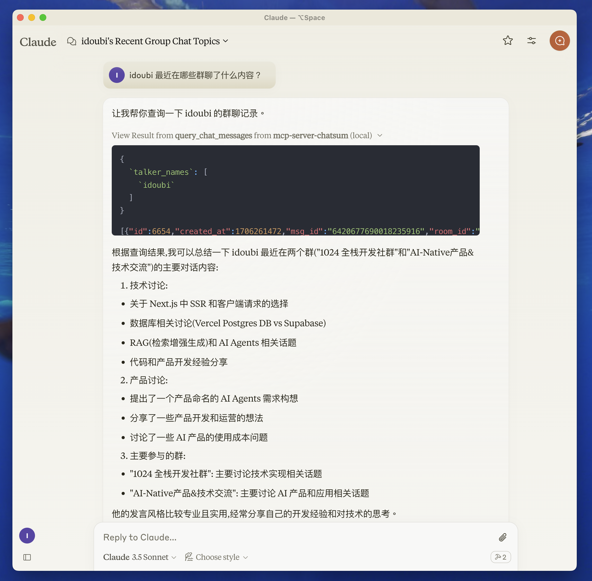

# mcp-server-chatsum

This MCP Server is used to summarize your chat messages.

[中文说明](README_CN.md)



> **Before you start**
>
> move to [chatbot](./chatbot) directory, follow the [README](./chatbot/README.md) to setup the chat database.
>
> start chatbot to save your chat messages.

## Features

### Resources

### Tools

- `query_chat_messages` - Query chat messages
  - Query chat messages with given parameters
  - Summarize chat messages based on the query prompt

### Prompts

## Development

1. Set up environment variables:

create `.env` file in the root directory, and set your chat database path.

```txt
CHAT_DB_PATH=path-to/chatbot/data/chat.db
```

2. Install dependencies:

```bash
pnpm install
```

Build the server:

```bash
pnpm build
```

For development with auto-rebuild:

```bash
pnpm watch
```

## Installation

To use with Claude Desktop, add the server config:

On MacOS: `~/Library/Application Support/Claude/claude_desktop_config.json`
On Windows: `%APPDATA%/Claude/claude_desktop_config.json`

```json
{
  "mcpServers": {
    "mcp-server-chatsum": {
      "command": "path-to/bin/node",
      "args": ["path-to/mcp-server-chatsum/build/index.js"],
      "env": {
        "CHAT_DB_PATH": "path-to/mcp-server-chatsum/chatbot/data/chat.db"
      }
    }
  }
}
```

### Debugging

Since MCP servers communicate over stdio, debugging can be challenging. We recommend using the [MCP Inspector](https://github.com/modelcontextprotocol/inspector), which is available as a package script:

```bash
pnpm inspector
```

The Inspector will provide a URL to access debugging tools in your browser.
